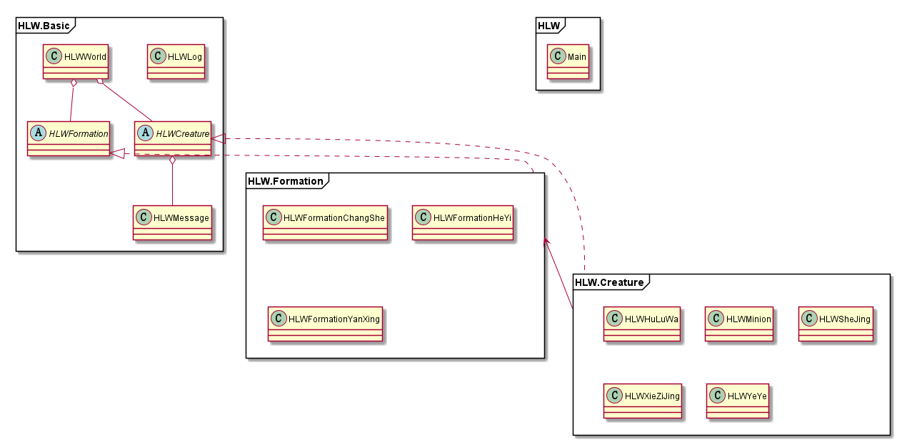

本次程序中一共有5个基类：HLWCreature(所有生命体的基类）、HLWFormation（所有阵型的基类），HLWLog(信息输入输出的类）、HLWMessage(生命体间通讯的类)和HLWWorld(所有生命体所在的世界，本质是一个坐标系)。

## HLWCreature

该类列出了一系列生物体的基本属性、行为以及一些信息输出的函数。其中一些函数代表所有生物体共有且完全一样的行为准则，因此在该抽象类中就完成了实现；有些函数虽然是共有的行为但是具体的实现或者输出有区别，就将其作为抽象函数（比如打印名字，不同的生物体打印的格式不一样），在子类中实现。

这里不需要用到接口是因为，大多数生物体的行为逻辑是几乎相同的，只存在一些细微的区别和属性上的区别，因此实用一个父类概括它们的所有行为；某些存在细微差别的行为，则通过抽象函数实现，让子类自身实现自己的操作。

### 生物间的信息传递

生物体之间消息传递，比如移动，交换位置等等，都是通过HLWMessage传递的。每个生物体都有一个发送信息的发送队列，以及一个接收信息的接受队列。每当要发送信息时，就会调用 ``prepareMessage()``函数，指定操作的类型（移动或者交换）以及操作的目标（交换位置的另一个生物体；移动的本体）；信息准备完毕后会放置在发送队列中，通过函数sendOneMessage()将队首的信息按照指定的目标发送出去，将信息放置到目标生物体的接收队列末尾。目标生物体则通过handleOneMessage()函数，取出接收队列队首的信息，进行处理。因此，信息的发送和信息的处理存在一个“先来先服务”的关系。

**这里的发送队列和接收队列都使用了泛型（使用了ArrayList\<HLWMessage\>）.**

## HLWForamtion

该类规定了所有队形的基本属性（名字，中心，容量大小等），基本接口（在子类中实现）和统一的函数（比如确定成员后进行列队操作、阵型的转化等等）。

### 队列的关键实现部分

对于所有阵型来说，列队时只需要通知不在指定位置的成员立即到指定位置即可，这部分逻辑是固定的；同理，阵型转化时，只需要将阵型中的成员从当前的成员列表中移动到一个新的阵型中即可（将当前阵型的成员复制到变换后的阵型中，同时清空当前阵型的成员列表）。

**阵型中的members变量也用到了泛型(使用ArrayList\<HLWCreature\>)**

阵型的两个关键函数:

- getBeginPosition()：找到阵型的起始位置，每一个阵型都应该人为地规定一个起始位置，方便对阵型中的成员进行操作；或者在阵型内部进行操作。
- findNextPositionInFormation():该函数接收一个参数——1个坐标值，通过该坐标值找到该阵型人为规定的下一个位置。该函数和getBeginPosition一起，可以遍历整个阵型，进行一些操作（比如在列队时就会用到这两个函数）。当然如果输入的坐标值参数本身就不属于这个阵型，那么该函数就会报错。

## HLWLog

该类是实现输入输出的一个类，比如输出作物信息或者提示信息时，就会调用该类的函数。目前该类只考虑实现一些静态函数：比如输出错误信息的HLW_ERROR和输出提示信息的HLW_NOTICE()。这两个函数不仅仅会输出错误信息，而且还会提示错误发生代码文件以及代码函数，精确定位发出信息的位置。

## HLWMessage

该类是HLWCreature之间进行通信的所必需的类。但其实它的内容非常简单，其主要是作为一个载体，承载信息的内容：比如信息的类型，信息的发送者，信息的接受者，以及信息的内容，其中信息的内容是根据信息的类型而变化的。目前的信息都比较简单，分为三种类型：

- move： 该信息的发送者就是接收者，信息的内容就是移动的向量：比如（3， 1）就代表x轴正向移动三个单位，y轴正向移动1个单位。
- move to: 该信息的发送者就是接收者，信息的内容是目标地点的坐标。
- switch: 该信息的接收者不能为空，必须是一个HLWCreature, 同时该信息的内容可以不指定。

后续过程中还会有别的信息类型。

## HLWWorld

该类是所有HLWCreature活动的世界，实际上是一个三维空间（当然z轴只有0,1取值，且设计该取值是为了执行生命体的switch行为。），类似于一个大棋盘，所有操作都是基于这个棋盘。

该棋盘首先有两个列表，装有两种HLWCreature：

- HuLuWaList装有所有正义阵营的HLWHuLuWa以及HuLuWaYeYe
- MonsterList装有所有邪恶阵营的HLWMinion(喽啰)、HLWXieZiJing和HLWSheJing。

每创建一个生命体，就会将其加入这两个列表，这样更便于快速的搜索地图上所有的生命体，而不必遍历所有的格子。

同时世界还负责查看某个位置是否已经被某生物体所占用，该功能在创建生物体时会被用到（函数checkLocation）；以及当生物移动时，HLWWorld还要负责将地图上生物原本所在的位置设为空，同时将新的位置设为该生物。（在生物移动时将会用到)

## 程序的运行过程：

	1. 首先创建一个HLWWorld
 	2. 创建两个阵型：长蛇阵与雁行阵，此时两个阵型只指定了中心点，并没有任何成员
 	3. 创建葫芦兄弟，并将他们加入长蛇阵；创建小喽啰和蝎子精，并将它们加入雁行阵。（此时创建出来的生命体都随机地分布在地图上）
 	4. 创建爷爷和蛇精，让他们站在地图的最边界处。(在这个过程中尝试使用了**反射机制**)
 	5. 让葫芦兄弟站列队（按阵型站队）；让喽啰和蝎子精列队。
 	6. 创建一个阵型：鹤翼阵，让雁行阵转化为鹤翼阵。
 	7. 转化之后让喽啰和蝎子精再次列队。

