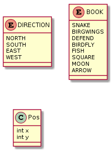
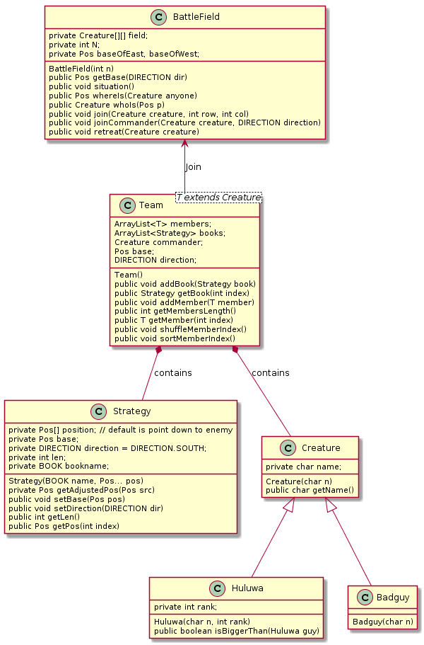

# 作业四 设计说明

## 类设计说明

本次作业中包含以下的类：

* BattleField，维护战场信息
* Strategy，指导阵型
* Team，维护队伍成员
* Creature，生物
  * Huluwa extends Creature，包含内部大小信息的葫芦娃

此外，还有一个起数据结构功能的类Pos，以及枚举类BOOK和DIRECTION。

## 类图





## 系统原理

整个系统的工作原理是这样的：

### 战前准备

1. 建立一个战场类对象battleField，构造函数中需要一个战场大小参数n来初始化战场大小。
2. 要建立一个队伍，就建立一个队伍类Team的对象。Team是一个泛型类，其中的`ArrayList<T> member`可以容纳基本战斗单位，`Creature commander`可以储存每队唯一的打气人，`ArrayList<Strategy>`可以储存兵书。
3. 兵书类Strategy类中储存了一系列位置，表明给定方向下，Team.member里的生物应该如何按顺序排兵布阵。
4. 兵书的具体定义储存在findbook(BOOK bookname)函数中，Team需要通过调用这个函数来获取兵书。
5. Creature初始化需要一个字符来表明单位身份，这里用数字表示葫芦娃，“兵”表示小喽啰等。
6. 葫芦娃的排序集成在Team里，通过反射机制来保证只有葫芦娃才可以排序。

### 战斗开始

1. Team里面有一个储存阵营朝向的变量`DIRECTION direction`。根据设定，葫芦娃坐西朝东，妖怪坐东朝西。通过浏览战场，队伍们可以找到自己的基点`Pos base`。（Team.base = battleField.getBase(direction);）
2. 上场之前，从兵书库中拿取一本兵书，然后将基点和朝向告诉兵书。兵书自动地将相对坐标转换为具体坐标，让队伍知道下一个参战者应该站在哪里。
3. 通过battleField.place(Creature creature, int row, int col)上场参战。
4. 通过battle.Field.retreat(Creature creature)撤回在阵生物。
5. 打气人有专属的放置和撤退方法。它们会放在战场的最后排，随机选取位置，既不会挡住参战者，也可以使得自己得以自保。


## 用到的面向对象理念

### 用对象编程

在设计中，战场中的元素都被设计为了对象，如战场、兵书、生物等。

### 消息传递

对象之间存在着各种消息传递。例如，通过getBase函数，战场的基点信息传递给队伍，而不会写死在队伍的定义中。对象的放置和撤离也不是简单的数组设值，以撤离为例，队伍将自己的某个成员信息交给战场，此时战场会自动定位到对象所在地点，并通知对象离开，不需要队伍自己记住成员位置然后操作战场数组。

### 封装

战场的各种信息被封装在内部，派遣和撤离都需要接口，而且撤离需要提供对象信息，不能直接指定某个位置的对象撤离。这样就避免了蝎子精直接通过数组设null的方式降维打击葫芦娃。

### 继承和多态

葫芦娃和坏人分别继承 Creature 类，也就是 Huluwa 和 Badguy。由于继承自 Creature，双方都可以插入到接受 Creature 参数的战场类中。

### 枚举类

通过枚举类的定义，使得兵书系统可以通过枚举的方式选择，避免了传错字符串找不到兵书的尴尬。


## 用到的反射和泛型

### 泛型

基于作业三的代码，作业四将 Team 修改为了泛型类，也就是`class Team<T extends Creature> `。相应的，`ArrayList<Creature> members`被修改为泛型List`ArrayList<T> members`。同时，使用到members的代码也做出了相应的调整。

```java
class Team<T extends Creature> {
    ArrayList<T> members;
    //...
```


### 反射

由于使用了泛型，无法再使用原来的方式对葫芦娃进行排序，因此如打乱功能一样，将排序功能集成到了Team中。但是坏人没有比较的方法，因此在排序方法中使用getMethod来调用葫芦娃的比较方法。

```java
try{
    Class<?> c = members.get(0).getClass();
    Method isBigger = c.getMethod("isBiggerThan", Huluwa.class);
    //...
    if ((boolean)isBigger.invoke(movingGuy, standbyGuy)){
        //...
    }
} catch (NoSuchMethodException e){
	System.out.println("Bad guys cannot sort!");
}
//...
```