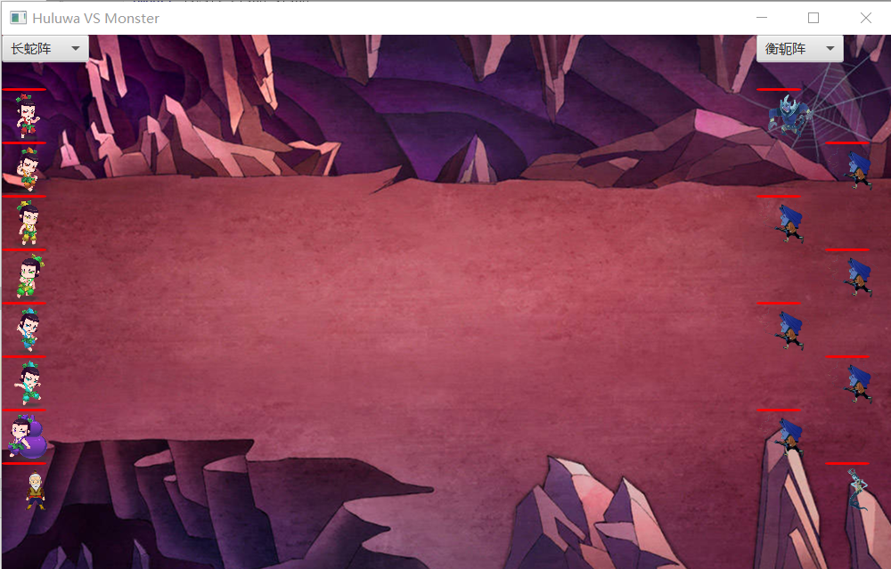
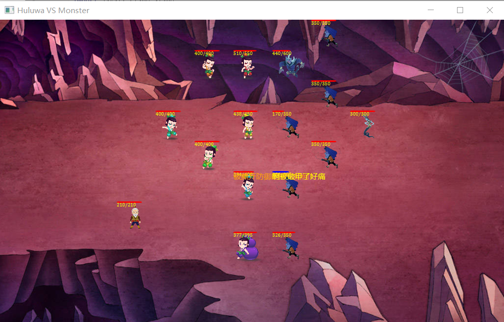
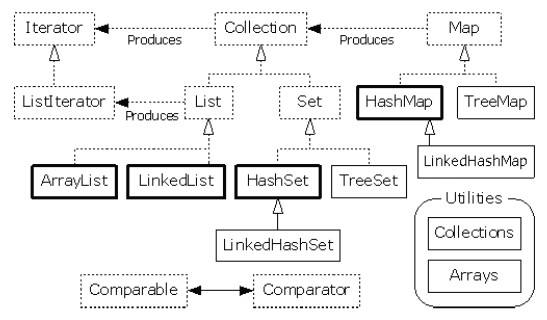

<h1>《葫芦娃大战妖精》实验报告</h1>
171860677 吴鸿祜

<h2>游戏介绍</h2>

- 葫芦山关着蝎子精和蛇精，有一天穿山甲打穿了山洞，妖精逃了出来，生灵涂炭之时，葫芦娃兄弟和爷爷与妖精
阵营展开了最后的决战

<h2>操作说明</h2>

- 玩家手动点击'开始游戏'，会新建一场战斗，进入战斗就绪画面阶段，进入游戏界面之后选好双方的阵形，按下空格即可观看葫芦娃阵营和妖精阵营的搏斗；
- 玩家在主界面，战斗未开始阶段，战斗结束阶段，都可以按下L打开文件对话框，选择某一个存档*.history，读档进行战斗回放
- 战斗进行阶段，玩家可以随时按下空格，停止/继续游戏，重新唤醒线程需要一点时间，请不要频繁连续按下空格
- 战斗结束，游戏不会被自动存档，玩家可以点击'保存游戏',打开文件对话框新建或覆盖存档

|选项|功能描述|
|:------|:----|
|开始游戏|开始一场葫芦娃与妖精新的较量|
|读取历史|打开存档，再回味一次精彩瞬间|
|关于游戏|查看各个角色的生命值，攻击等属性和特点描述|

<h2>游戏性说明</h2>

- 葫芦娃阵营和蛇精阵营会相互靠近，当进入到对方的**攻击距离**时会进行攻击
- 寻找敌人的逻辑比较简单，就是去靠近离自己最近的那个敌方生物，一旦进入到自己的攻击距离则停下来攻击对方
- 每个生物都有**速度**属性，这里的速度相当于线程睡眠时间长短，速度越快，线程休眠的时间越短，则同一时间
攻击或者移动的次数就会较多
- 伤害计算公式为 伤害=**当前攻击**-对方**防御力**,每次攻击时会利用随机数生成进行暴击判断，如果触发**暴击**,则会造成 伤害=当前攻击*2-对方防御力，当然部分角色暴击有特殊效果，详见 **'关于游戏’**
- 暴击判定成功时，每个角色会触发专属的台词，显示为橙色字体，比如三娃的特点是防御力高，当他暴击的时候会触发
台词 **'固若金汤!'**，并且防御力提升，造成防御力百分比额外伤害

|角色|特点描述|
|:------|:----|
|大娃|攻击和生命值较高，暴击可造成3~4倍伤害|
|二娃|善于窥破敌人弱点，战斗中能够不断提高暴击率|
|三娃|防御力高，暴击时提高防御|
|四娃|暴击时会对中了Debuff的敌人造成额外伤害|
|五娃|暴击时会给敌人造成破甲Debuff|
|六娃|身法飘逸，拥有高速和远距离攻击|
|七娃|善于用毒，暴击时会给敌人造成中毒Debuff|
|爷爷|爷爷没有攻击能力，但能对孩子们加血治疗|
|蝎子精|具有高生命值高攻高防，攻击吸血，但速度较慢|
|蛇精|高速高攻，远距离攻击，但防御较低|
|小喽啰|中等程度的属性，比较均匀|

<h2>游戏界面</h2>

- 主界面

- 游戏就绪界面(双方初始阵容默认为'长蛇阵'和'衡轭阵')

- 战斗过程画面

- 战斗结束画面

- 按下L键的时候，打开文件对话框,显示已有的存档记录

<h2>背景音乐</h2>

BGM素材均来源于《金庸群侠传》游戏BGM，共4首BGM在特定时候切换播放
- 主界面bgm
- 战斗bgm
- 葫芦娃胜利bgm
- 葫芦娃失败bgm

<h2>代码框架</h2>

<h3>总体框架UML图</h3>

<h3>Package说明</h3>

<h4>1.controller 包含了UI相关的实现</h4>

* PrimaryController: javafx界面的事件处理类
* MusicPlayer: 用于播放和切换BGM的播放器类
* Replay: 用于读取存档和回放的文件功能类

<h4>2.creature 包含了游戏生物的描述和功能</h4>

* Creature: 生物类的基类，定义了生物的基本属性
* Huluwa: 葫芦娃
* Grandpa: 爷爷
* Scorpion: 蝎子精
* Snake: 蛇精
* Sodier：士兵
* Land：战场上空白的土地

<h5>接口定义</h5>

* FightStrategy: 各种生物的攻击逻辑是不同的，因此用接口定义了生物对战的功能

<h5>枚举类型定义</h5>

* Debuff: 生物的负面状态包括：中毒，破甲等

<h5>此外定义了一个生物信息的介绍类，用于'关于游戏'功能的查看属性功能</h5>

* CreatureIntroduction: 描述了各种生物的生命值，攻击力等属性值和特点

<h4>3.map 定义了地图的功能和描述</h4>

* Field: 包含一个MxN的二维空间进行战斗场景的描述，提供各种公共接口用于地图状态的改变
* Position: 描述了一个二维坐标（X,Y)

<h4>4.formation 包含了各种阵型的描述</h4>

* Formation: 阵形类的基类，首先定义一个与地图等大的二维空间供阵型的摆放
* ChangsheFormation:长蛇阵
* ...其他阵型类同理
* FormationGenerator: 工厂类，外部类要申请一个阵型对象时，通过工厂类进行生产，而不是直接new一个对象

<h5>接口定义</h5>

* Generator:泛型接口，包含了方法produceFormation

<h4>5.bloodBar 定义了生命值血槽的描述</h4>

* BloodBar: 继承于javafx的矩形控件类Rectangle,显示生命值的长度，血槽的本质是一个矩形，但为了扩展功能将其继承封装为血槽类

<h4>6.talk 包含了各种生物的台词描述</h4>

* Talking: 为了增加游戏趣味性，生物在战斗时会根据当前状态和随机数，显示一些台词。Talking继承于
javafx的标签控件类Label，存储了很多可以话语字符串，提供对外接口来使用

<h3>代码设计中使用到的知识</h3>

<h4>面向对象程序设计</h4>

* 面向对象程序设计主要遵循**封装**,**继承**和**多态**三个特点
* 首先是封装特点，在代码设计过程中我时刻牢记该要点，尽量做到一个较大的功能或者一个实体封装为一个个类，
一个类包括了数据以及操作数据的功能，封装有利于隐藏内部属性，仅提供对外接口进行黑箱操作。封装也有利于降低对象间的耦合，
提高代码的模块化水平
* 在我的程序中，大量使用到继承的思想，比如类的继承，各种生物均继承于一个基类Creature，阵型继承于Formation，
血槽继承于矩形控件Rectangle，台词显示继承于标签控件Label。类的继承可以直接使用基类的属性和功能，并且进行扩展；
另外就是接口的使用，由于程序中涉及到不少线程，序列化/反序列化的细节，所以比如Creature就要implements Java定义好
的接口Runnable, Serializable，接口仅声明方法，具体的实现交给子类来完成
* 多态是“一个接口，多种实现”，不同的对象发出相同的消息是会有不同的行为的，比如我定义的接口FightStrategy，正是考虑到不同的生物
在战斗中会有不同的逻辑(比如各人暴击时的效果和行为是不一样的)，这样不同对象可以通过调用接口中的方法fight(Creature creature)
，产生不同的逻辑

<h4>设计原则</h4>

<h5>SRP单一职责原则</h5>

就一个类而言，应该只有一个引起它变化的原因。在我的代码里面，尽量遵循了该原则，除了界面事件处理类之外，
其他的类尽可能仅承担一个职责，比如BloodBar类仅负责血槽的修改，Talking仅负责台词的修改

<h5>OCP开放封闭原则</h5>

一个软件实体应当对扩展开放，对修改关闭。即软件实体应尽量在不修改原有代码的情况下进行扩展。
在我的代码设计中，比如阵法类的设计，利用继承对基类Formation进行扩展，同时利用了反射机制和工厂模式，
每当扩展了一种阵型，只需在type[]中添加相应的类名即可，无需再对原有的代码进行频繁改动

<h5>Liskov替换法则</h5>

子类可以扩展父类的功能，但不能改变父类原有的功能。它的基本含义：子类可以实现父类的抽象方法，但不能覆盖父类的非抽象方法。
在我的设计中，使用了大量的继承，但基本没有重写或覆盖父类的非抽象方法，而是各自扩展方法功能。此外，但凡有方法涉及调用具有派生类的
参数时，我都把参数类型设计为基类，这样使用者无需了解具体的差异所在，仅需知道它的边界类型确实是一个基类即可

<h5>CARP合成/聚合复用原则</h5>

在一个新的对象里面使用一些已有的对象，使之成为新对象的一部分；新的对象通过向这些对象的委派达到复用已有功能的目的。
在我的设计中，也用到很多聚合的思想，比如事件处理类Controller中聚合了播放器类Player和回放录制类Replay，每个成员类都可以
将精力聚焦于一个任务中，播放器类专门用于播放BGM，回放类负责将存档文件反序列化回放

<h4>设计模式</h4>

在我的代码中主要是使用工厂模式，工厂模式专门负责将大量有共同接口的类实例化。工厂模式可以动态决定将哪一个类实例化，
比如阵型Package中我定义了一个简单工厂类，根据传入来的字符串参数，通过**反射**获取相应的类并进行实例化，将创建好的对象返回给使用者

<h4>多线程</h4>

在我的程序中，有很多地方涉及到线程的创建和同步。
- 在游戏刚启动时，会创建一个线程专门播放BGM，一个线程监听键盘输入，一个专门线程负责UI的刷新（Platform.run
- 进入战斗准备界面中，会新建两个线程监听ComboBox控件的事件变化，因为玩家从多选框中选取阵型是一个动态变化的事件，需要时刻保持
监听并将变化传给地图进行修改，战斗开始之后会终止这两个线程
- 在战斗过程中，由于我增加了很多游戏属性，特别是生命值的变量，所以并不会再出现基本要求中只能一对一战斗以及按概率决定死亡的情况，
而是允许多个线程对一个敌人进行攻击，按照各自的战斗逻辑扣除血量直到死亡，所以需要考虑的细节只有敌人死亡时不允许多个线程抢占地图上的
同一个位置，这里使用锁机制，当一个线程准备占据死亡生物的位置时，会将地图类的该位置上锁，等到该线程的位置交换好之后，再解锁，这样就可以避免
多个生物占据同一个位置的情况
- 在读取存档时，创建一个线程进行文件的读取和反序列化操作，利用**FutureTask**驱动任务，最后返回结果，利用get()异步获取结果，FutureTask的好处在于
主线程能够完成自己的任务之后，再去获取结果。这样就无需浪费时间在等待耗时的计算

<h4>集合类型</h4>

在我的程序中主要使用的集合类型是ArrayList\<T>,因为在很多情况下无法确切得知数据量到底有多少，
如果数组的空间开得过大会造成浪费，开得小了又会导致异常出现。比如在录制游戏过程中，我使用了
ArrayList<Creature[][]> historyField来记录每一帧地图的各个生物情况，由于每次战斗的时间长短
是不确定的，所以需要记录的帧数也是不相同的，这时候利用ArrayList来进行存储和查询就比较方便

<h4>泛型</h4>

泛型的本质是参数化类型，也就是说所操作的数据类型被指定为一个参数。Java中的泛型特性一般是指泛型方法与泛型类。一个泛型方法，该方法在调用时可以接收不同类型的参数
。在程序中我主要以多态来设计方法居多，泛型在使用工厂模式时定义了一个泛型接口Generator<T>，将接口设计为泛型，主要是考虑到除了阵型Formation之外，例如Creature包也可以使用
该泛型接口，进行工厂模式的设计，使得代码的复用性提高

<h4>输入输出</h4>

- Java所有的I/O机制都是基于数据流进行输入输出，这些数据流表示了字符或者字节数据的流动序列。Java的I/O流提供了读写数据的标准方法。任何Java中表示数据源的对象都会提供以数据流的方式读写它的数据的方法。
- 在代码中主要有两个点和文件读写相关频繁相关，一是读取资源文件中的图片等资源时，需要利用反射和字节流的方法进行快速获取: **this.getClass().getResourceAsStream("/XXX.png")**
,另一方面就是在下文提到的序列化/反序列化过程中使用到的读写对象，文件的读写字节流是一个典型的装饰器模式的结构，通过字节流实现对象的读写：**new ObjectOutputStream(new FileOutputStream(new File(pathname)))**
和**new ObjectInputStream(new FileInputStream(new File(pathname)))**

<h4>序列化和反序列化</h4>

- 使用Java对象序列化，在保存对象时，会把其状态保存为一组字节，在未来，再将这些字节组装成对象
- 这部分知识主要用于录制和回放两个过程，在新游戏开始之后，每次刷新UI时都会顺便将该帧的地图信息保存下来
到上文提到的ArrayList<Creature[][]> historyField;当游戏结束之后，如果玩家选择保存游戏，则会将该集合中的每一个
二维数组中的每一个对象进行序列化操作，以字节的形式保存到后缀名为'.history'的自定义文本中
- 由于一场战斗中最终保存的对象多达几千个，而每个生物对象的状态信息是很多的(详见Creature类及其派生类),但很多信息是
在回放中不需要用到的，所以为了节省存储空间，可以使用关键字**transient**标记某些成员属性，这样在序列化的时候就会被忽略
- 读取存档的过程就是反序列化的过程，由于序列化的时候对象是被逐行地被记录到文本中，所以反序列化时逐行操作，根据地图的宽度和高度
反过来对应到每个位置，就可以还原得到historyField的内容，从而逐帧读取即可实现回放功能
- 由于上千个对象的反序列化是需要一定时间的，所以如果将这部分方法调用，放到主线程中串行执行，会导致玩家在选定存档文件之后有几秒卡顿
才会继续执行后面的控件初始化等操作，因为这几秒在进行文件的读取和反序列化操作，无法执行其他操作。所以在这里我将回放工具类Replay实现了**Callable**接口,
将文件读取和反序列化的方法调用放到run方法中，利用FutureTask<ArrayList<Creature[][]\>\>进行任务驱动，这样javafx主线程就可以做完读取存档的其他
初始化工作之后，再用get异步获得反序列化的结果。而这个优化对于玩家的直观感受就是选取存档文件点击'确定'之后,会直接进入战斗准备界面，而没有卡顿和等待过久的情况。

<h4>异常处理</h4>

异常是指程序运行中出现的一些错误，这类错误有时可以在处理后使程序在原有状态下继续运行，这就要依赖于Java提供的异常处理机制
在我的代码的设计过程中，几乎一半的时间需要依靠这些异常抛出来定位错误的地方，代码中主要的2类异常情况：
- 文件读写的IOException
- 线程运行时的InterruptedException
 
<h4>测试</h4>

- 由于使用maven进行项目管理，所以测试模块统一放在了 **./src/test/java/MyTest.java**
，使用juint4.11来进行单元测试
- 测试的重点在于地图和阵型的交互测试，比如往地图里面添加/切换阵型，测试阵型的工厂类是否能够正确生成对象，测试
地图能否正确增加/删除单个生物对象
- 此外在测试中体会了一下注解的使用，除了单元测试必要的@Test外，尝试了@BeforeClass,@AfterClass等的使用 

<h3>结束语</h3>

虽然自己做的葫芦娃游戏非常粗糙简陋，但是在设计的过程中对一学期的内容有了更加深刻的体会，同时第一次接触maven进行项目自动化
构建，遇到了非常多的困难，但通过Google和阅读各种官方文档，还是尽自己所能去解决了，非常感谢曹老师和余老师一学期的教导