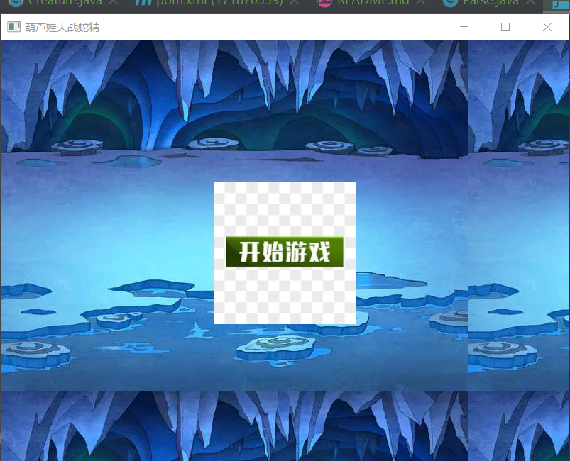
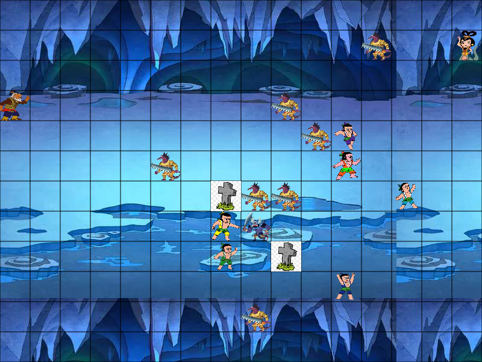
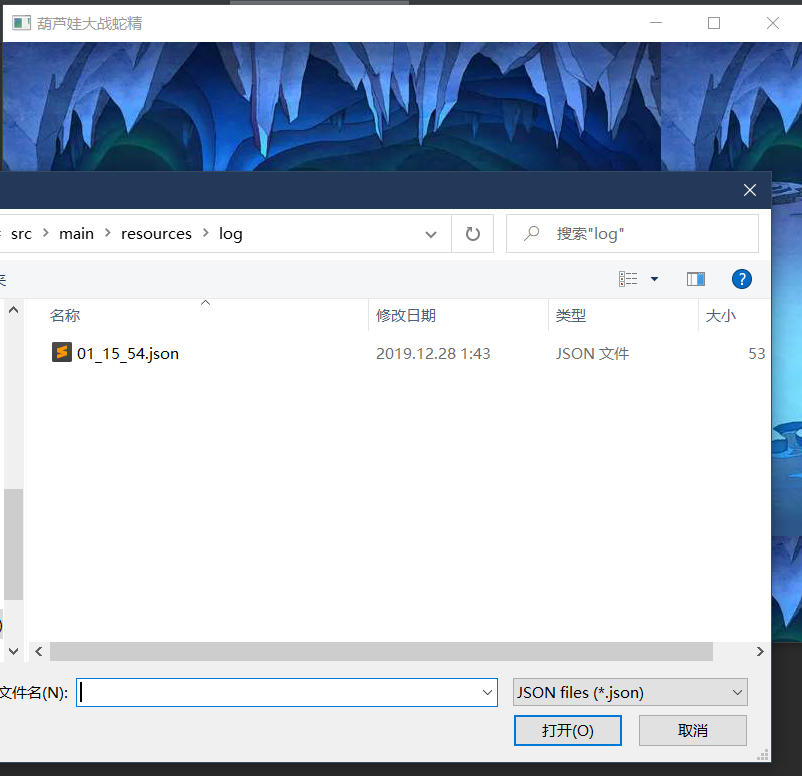
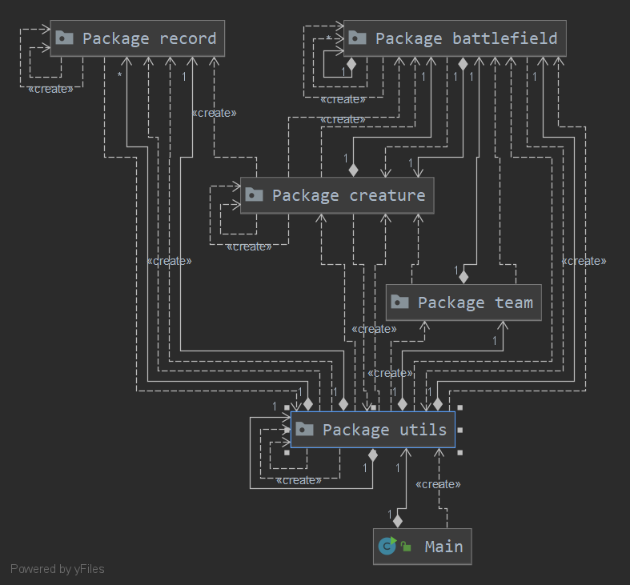
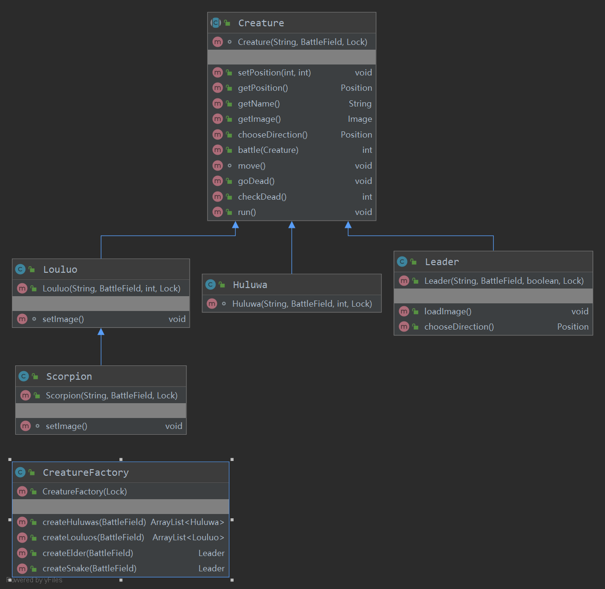
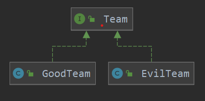
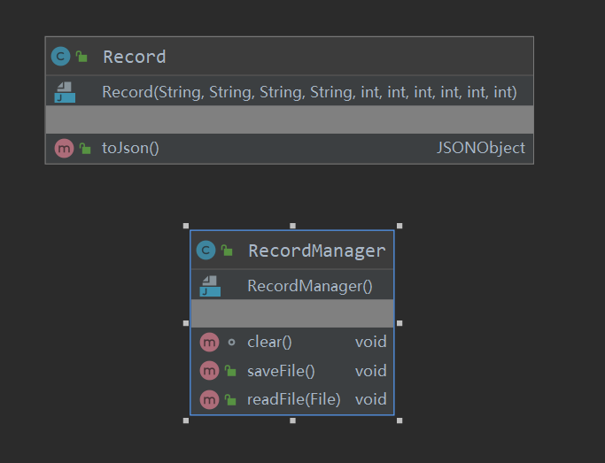

# 大作业实验报告
171870559 季镇澜


## 1. 效果展示

初始界面



进行中画面



读取文件




作战记录使用json格式文件存取，以当时时间为文件名，形式如下

```json
[
  {
    "winTeam": "None",
    "preX": 0,
    "objY": 1,
    "preY": 0,
    "objX": 0,
    "ownLive": 1,
    "enemyLive": 1,
    "name": "elder",
    "action": "Move",
    "step": 0,
    "objName": ""
  },
]
```


## 2. 操作方式和游戏机制

打开游戏后，按下空格即可启动，游戏在一局游戏后自动保存记录为一个json文件。按下空格键启动后，场上生物分为善恶两个阵营，每个阵营均有一个领导者（善方为老爷爷，恶方为蛇精）和数个士兵，士兵即葫芦娃或小喽啰和蝎子精。

所有葫芦娃的攻击力为4，蝎子精为5，普通的小喽啰则只有2，而领导者的攻击力则为1，另外，根据动画中的内容，将葫芦娃设定的普遍强一些，所以葫芦娃每次可移动两格，攻击距离同理，而其他所有生物只能移动和攻击一格。所有士兵随机选择向前或者向左右两方移动，但他们向前移动的概率是向一边移动概率的3倍，而领导者则只能向左右移动。

参考动画中的剧情，将每一方的领导者安排在各自阵型的最后一排，当他们中的任意一个被打倒后，游戏即结束，领导者死亡的那一方阵营宣告失败，游戏则会弹出相应的图片，因为默认玩家为葫芦娃一方，因此当葫芦娃胜利时，弹出胜利标识，反之则为失败。


#### 说明

游戏进行时，通过设置一个额外的supervisor（注意，这不被视为生物，因此也不在creature包内）进程监视游戏情况，为节省时间，采用按时绘制出一帧情况，一帧的变动可能有多个生物进行了行动。但在回放中，考虑到玩家希望能跟精确的了解战斗情况，为了使回放更有意义，故放慢战斗显示速度，限定每一帧只显示一个生物的动作。一次，在肉眼上进行游戏和回放记录可能有些许不同，但每个生物的行动都是完全一致的。

#### 注意

优秀作战记录存放在 /java-2019-homeworks/Final/季镇澜-171870559/src/main/resources/log/ 中

## 3. 程序设计



本代码主要由5部分和一个作为进入口的Main.java组成，他们也被分为5个package，如上所示：

1. Package creature：

    

    如上所示，Creature类作为这个所有生物体的基类，本身是一个抽象类，但实现了所有战场上生物的共通特性，如battle，move等动作，而Huluwa、Scorpion、Leader等类则继承了这个基类并在其基础上有所变化

    

    除此以外，还定义了一个CreatureFactory类，因为考虑到生物创建较为繁琐，且容易出错，故将创建过程直接封装在这一类中，使程序实现高内聚

2. Package team：

    

    考虑到两个team内部存在较大差异，定义一个共同的抽象基类再衍生出两个不同的类显得并不经济，因此定义了一个接口Team，两个类GoodTeam和EvilTeam则实现了该接口。

    考虑到代码的可复用性和可扩展性，在GoodTeam和EvilTeam的定义中加入了泛型，支持在双方加入新的生物类型

3. Package  battlefield

    

    该包内的类定义了位置和战场场地，另外，内含的Formation为阵法的实现，Formation本身为抽象类，其拥有的两个静态属性即为继承自Formation的实体类，这样，在需要布阵时，可以直接进行调用

4. Package record

    为了能够保存并读取记录，定义了Record和RecordManager，前者定义了一条记录的格式和并内含转化为json的方法，而RecordManager则负责文件读写和全局标量RECORDS的维护

5. Package utils

    

    这个包内部是各个工具类：

    1. 存储全局变量的Config。
    2. UI负责对画布的操控和UI的初始化。
    3. Parse负责将Record的记录解析为一个具体的动作并执行，为了能够是解析和动画同步实现，本身实现了Runable接口，使用并发的方式进行回放。
    4. Controller是整个程序的主控，负责各个进程的创建、控制、结束以及其他动作的实现，同时，内置了在**游戏机制**中提到的Supervisor负责在游戏进行时监视游戏进程。


## 4. 设计原则实现

1. #### SRP (The Single-Responsibility Principle)

    需要将复杂功能分解，以使得每个类负责一个原子职责。每个变化就是类的一个职责。当需求发生变化时，对应的反映为职责的变化。如果一个类承担多个职责，那么引起类变化的原因就有多个，等于就把这些职责耦合化了。。在本程序中，回放功能被分解为三个类，分别是负责单个记录创建的Record，记录集维护的RecordManager和记录解析的Parse。

2. #### OCP (The Open-Closed Principle)

    开放-封闭原则中开放是指对扩展开放，封闭是指不必对原有模块进行修改。也就是说，当需求发生变化时，我们只需要添加新的模块，而无需修改原有代码。

    在Creature实现中，当需要创建新的生物类型是，只需要继承基础的Creature抽象类并添加新的模块，而不需要对已有的代码进行修改

3. #### LSP (The Liskov Substitution Principle)

    liskov替换要求子类型能够替换基类型。如果不能替换，导致将子类型赋值给基指针时导致开发者错误以为该指针指的是基类，错误使用基类中有，而子类中没有的方法，导致错误。

    在本程序中，Scorpion继承了Louluo类，作为子类，它能够替换其基类型，这一特质也确保了在EvilTeam中可以创建一个包含了Scorpion和Louluo的ArrayList。

4. #### ISP (The Interface-Segregation Principle)

    即不应该强迫客户依赖于它们不用的方法。

    本程序中控制了Interface的创建，确保每个对接口的实现都是当前类的职责所必需的的

5. #### DIP (The Dependency-Inversion Principle)

    依赖倒置原则：高层模块不依赖底层模块，二者依赖抽象；抽象不依赖细节，细节依赖抽象。如果高层依赖底层，导致底层的修改影响到高层，这是不应该的。

    本项目中，高层调用——CreatureFactory和底层实现Huluwa都以赖于抽象类Creature


## 5.面向对象特性和各机制实现

***封装、继承和多态特性在程序设计中已有阐述，这里不再重复***

1. 异常处理

    主要用于多线程和文件IO中，其中多线程用于追踪错误，主要用于调试，而文件IO中使用异常处理以避免因找不到文件，文件无法打开而导致的程序异常卡死问题

2. 集合类型

    主要使用了ArrayList，负责管理两个Team中的多个士兵生物。以及RECORDS也使用了ArrayList目的是顺序的存储作战记录

3. 泛型

    在GoodTeam和EvilTeam中有所体现

4. 注解

    主要使用了@Override和单元测试中所需的注解

5. 输入输出

    在文件IO中有所体现

6. 单元测试

    详情见test，对Creature、EvilTeam等类中一些容易引发异常的关键的方法进行了单元测试


