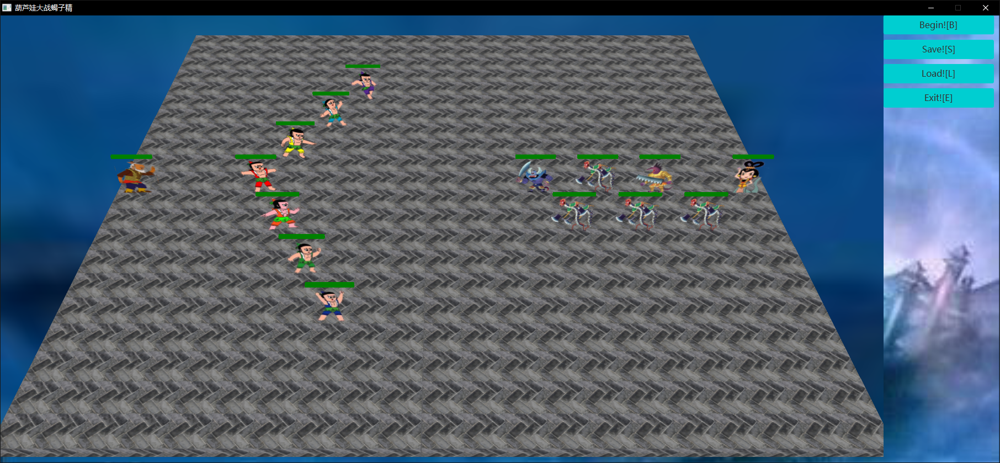
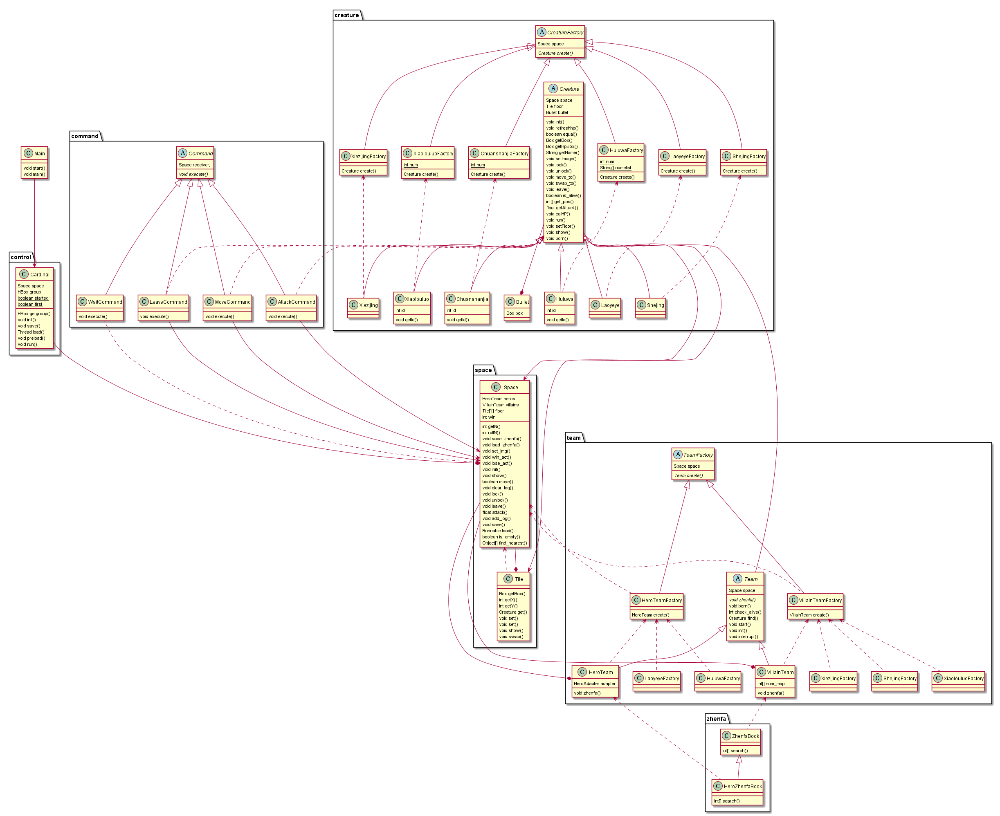

# 2019 JAVA Final Homework

## 1. 游戏机制

### 1.1 画面设计

参考*明日方舟*游戏的风格，采用地板为3D模型的基础上绘制纸片小人的设计方式，直接使用Box()对象绘制一个个地板，之后使用Depth为0的Box()绘制小人和胜利失败图片，用柱状（Depth和Height均为0.1）的Box()绘制血条和子弹。

### 1.2 人物设定

考虑到老爷爷和蛇精只站在两侧加油助威显得有些寂寞，而且蛇精本身也有boss性质的设定，因此我将他们也加入到战斗中。又考虑到葫芦娃一方只有7人无法摆出复杂的多人阵型（如鱼鳞阵），因此额外加入了可同时出现多个的穿山甲角色填充阵型。

### 1.3 属性设置

每个角色有5个属性：血量、攻击、防御、速度、攻击范围。为了便于修改调整，所有人物的属性从配置文件config.txt中，其次序为：

- 第1行：老爷爷;血量高，其他属性均中等偏下；
- 第2~8行：葫芦娃大娃~七娃；这里目前没有做葫芦娃的差异性设置，均统一为各属性中等偏高的水平；
- 第9行：蛇精；大boss,血量攻击均高，防御偏高，攻击范围远；
- 第10行：蝎子精；小boss,血量攻击均偏高，防御高；
- 第11行：小喽啰；设定为各属性均中等偏下但速度偏快，只能近战；
- 第12行：穿山甲；设定为血薄攻击弱但护甲高速度快，只能近战；

### 1.4 战斗设置

战斗机制上采用战棋类桌游掷骰子的设定，攻击和防御双方分别按照各自攻击、防御值扔该数量的骰子并将点数加总，最后做差求得造成的伤害。

### 1.5死亡设置

角色死亡后会变为墓碑存在于场上，但考虑到目前的寻路机制会导致两方角色无限循环地卡住的情况导致游戏无法结束，因此目前死亡后没有碰撞体积阻塞其他角色通过。

### 1.6 操作设置

右侧有四个按键，分别绑定了4个快捷键：

- 开始：B (因为没能解决javafx默认空格绑定重复点击上次点击的按钮的功能，故修改了开始的快捷键绑定)
- 保存：S
- 载入：L
- 退出：E

## 2. 设计思想和设计模式

首先定义生物类`Creature`，同时下派葫芦娃、老爷爷、蛇精、蝎子精、小喽啰、穿山甲六个子类继承生物类；其次定义了`Team`类，以及`HeroTeam`和`VillainTeam`两个子类分别对葫芦娃一方和蛇精一方统一管理；整个棋盘`Space`类只需创建正反派两个队伍类进行高层次的操作即可。

在对生物和队伍的构建上采用工厂模式，定义`CreatureFactory`和`TeamFactory`两个抽象类和下面6个生物工厂子类和2个队伍工厂子类对具体的队伍和生物进行构建。

而队伍本身采用组合模式的设计模式，`Team`继承了`ArrayList<Creature>`,利用泛型机制便于直接对队伍进行遍历、添加删除等操作。

对于生物的移动、攻击、离开等行为，采用命令模式的设计模式，定义了`Command`模板类和`MoveCommand`、`LeaveCommand`、`AttackCommand`子类，生物要移动、离开棋盘、发起攻击时创建对应命令的实例请求，其中传入其所在空间`Space`对象的索引作为Receiver，对应`Command`对象则调用`Space`对应的接受函数，将该生物所在坐标`Tile`上的内容与目的`Tile`上的内容进行交换实现生物的移动、查找目标生物发起攻击、将生物从棋盘上删去等操作；同时使用命令模式使得记录整场战斗变得容易；统一使用`Space`类作为Receiver通过加锁也使得并行在此可以串行化，得以保证指令和数据的正确性。

对于阵法，设计了阵法类`ZhenfaBook`，一个队伍创建时同时实例化阵法书对象，之后在摆阵法时直接查阅该阵法书指挥，在指挥时利用反射机制，对队伍内生物进行运行时的类型检查从而分配到不同的阵法位置中；而阵法书本身生成的坐标是对于反派而言的，为了以后扩展使得葫芦娃也可以摆出多种阵型，这里使用了适配器模式，生成了一个`HeroZhenfaBook`的子类，实际上是作为适配器封装了原有阵法书，将横坐标对折输出从而生成葫芦娃队伍的坐标查阅信息。

对于并发，`Creature`类内实现了`Runnable`接口，以`alive`变量为开关永远循环执行生物自己的行动逻辑（移动、攻击），并每执行一轮后通过`yield()`方法放弃资源给其他生物的线程，实现尽量公平的轮流执行行动；而其父进程为`Cardinal`主控类。`Cardinal`类实现`Runnable`接口，内部建立并管理`Space`实例和其中的`heros`、`villains`两方队伍，启动战斗时开启`Cardinal`进程，再由他启动全部生物进程并进行监控，若有一方获胜则通过`interrupt()`中断所有进程，结束战斗。

对于战斗记录，在命令模式的帮助下，直接声明一个日志数组`ArrayList<Command>`，使用泛型机制在每条命令执行后将其存入该数组中；同时另外定义`WaitCommand`类,记录两次命令执行的时间间隔，从而使得恢复时只需读入整个日志数组，逐条执行`execute()`方法即可复原战斗过程。

同时对于并发产生的冲突上，采用上锁技术进行解决。同样在命令模式的帮助下，在包含写操作的命令`Command`对象内部进行加锁和解锁。这里参考采用了一级封锁协议，对数据在进行写操作之前进行上锁，从而可以避免丢失修改的现象；而对于脏读和不可重复读，考虑到实际“查询操作”只有对`Space`中地板上坐标的查询和对`Creature`本身是否存活两种查询，前者通过查询后直接跟踪生物名称确定生物个体这一不变的量而避免脏读、不可重复读产生的目标坐标查询时有该生物，而执行命令时无该生物的情况出现（例如攻击时子弹追踪生物而非定向到固定坐标）；对于`Creature`是否存活的查询，在执行指令时加锁后进行第二次确认，从而忽略脏读和不可重复读引起的结果（例如看到对方存活时准备发起攻击，发起攻击时对方已死则默认这次攻击也继续进行，只是对对方造成0伤害）。因此可以确保线程间通信的正确性。

对于GUI,每一层次对象负责构建各自的GUI对象：`Creature`类内构建自己的`Box`并加载图片、血条颜色等属性；`Tile`类构建自己的地砖样式；`Space`类直接继承了`Group`,参考组合模式，将一个空间中的所有对象（地砖、两方队伍、背景图片、胜负的图片）加载到自己当中；`Cardinal`类则建立`Space`示例为其做更高层的封装和配置，添加摄像机、光源、封装为`SubScene`等。最后`Main`类直接声明`Cardinal`类获取其构建的`HBox`对象添加到`Scene`中进行显示。

## 3. 设计原则

### SRP单一职责原则

虽然这里将类的GUI都集成在了一个类内而没有分离，但并没有违反单一职责原则，因为考虑到这里实际应用场景，每个实体对象都必须有其GUI显示，因此GUI与该对象总是一起出现、相互关联的（如生物在地砖上移动伴随GUI的移动、生物死亡伴随GUI更换图片）所以没有必要将其分离。

同时使用了抽象类，所有有必要存在的方法都在父类的抽象类中实现；子类需要差异化实现的方法只在子类中实现，因此每个类只根据自己的责任实现方法。

### OCP开放-封闭原则

`Creature`类、`Command`类为抽象类，即为所有生物对象和命令对象的模板，开放了各种需要的新功能扩展但封闭了对`Creature`类内通用方法的修改。如对所有`Creature`类，其只有一个`name`作为识别（因为大部分生物只存在一个个体），但对于`Huluwa`和`Xiaolouluo`等类，各自扩展了`id`属性做进一步同类对象的区分识别。

### LSP Liskov替换法则

子类可替换基类。继承时子类没有修改父类的非抽象方法；对生物对象进行操作时，全部都声明使用Creature类型的变量进行操作，因此均支持子类替换基类；同样Command类也在操作时都以Command类型变量进行操作，子类完全可以替换基类。

### DIP依赖倒置原则

所有子类都依赖于父类抽象类: `Huluwa`、`Shejing`等类均依赖于`Creature`；`MoveCommand`、`AttackCommand`等类均依赖于`Command`类。

同时高层类和底层类也都依赖于抽象：`Space`等类中对生物进行操作时只使用`Creature`类型的变量，使用泛型和反射机制进行操作而不依赖于具体的子类；对`Command`类对象也是如此。

### ISP接口隔离原则

接口隔离原则目的在于胖类接口的分解。而我在程序设计中基本上一个方法只对应一个调用接口，因此基本不存在为了兼容多个调用而扩展的胖接口现象，如果有也做出了接口的重载和分解，如对于生物的移动行为，存在两种需求：摆阵法时可替换的强制移动和执行程序时目标有生物就不可执行的移动，统一设计为调用MoveCommand命令传入一个是否强制执行的force布尔变量后进行了封装：move_to和swap_to两个方法，从而分离了两个接口，实现了接口隔离。

### LoD 最少知识原则

对于类内属性的访问，若只有读取访问均封装为了方法，如：`getN()`,`is_alive()`等,从而使得可以将这些属性变为private私有，实现信息隐藏。同时程序写完后结合idea重新审阅了一遍代码，将idea判断可为private或protect类型的变量全部自动降级，实现最大程度上的信息隐藏。

## 4. 其他机制

### 4.1 异常处理

根据程序的设计和实际应用背景，额外自定义了5种异常，便于Debug：

- OutOfNumException：越界异常类
  - HuluwaOutOfNumException：葫芦娃越界异常（即超过了7个），在工厂类创建葫芦娃异常时会抛出；
  - ZhenfaOutOfNumException：阵法越界异常（阵法ID超出了8），在阵法类响应查询时异常会抛出；
- CharacterNotFound：找不到该角色异常，在Space响应移动、攻击等命令请求时若找不到角色会抛出；
- CharacterErrorException: 遇到了不应存在的生物类型异常，在Team类根据角色调用阵法查询时遇到不认识/不应该属于该类的角色时会抛出；

### 4.2 集合类型

对于战斗记录，使用`ArrayList<Command>`来存储整个战斗的过程；

对于`Team`类，配合使用组合模式 的设计模式，也继承了`ArrayList<Creature>`，统一存储管理一队的生物。

### 4.3 泛型

对于所有葫芦娃、老爷爷、小喽啰等生物，在处理时都统一使用了`Creature`类进行处理，如在存储时是放在`ArrayList<Creature>`中，在进行移动、离开、判断生死等操时也均只使用`Creature`类中的方法或抽象方法；

对于战斗记录的日志，使用`ArrayList<Command>`类型进行统一存储；而在进行回放时也直接遍历该数组执行`execute()`抽象方法进行回放。

### 4.4 注解

对于重载的方法使用了`@Override`注解；

对于根据之前作业4移植过来，而后使用GUI后弃用的`show()`函数加上了`@Deprecated`注解；

在测试时使用了`@Test`和`@BeforeClass`注解；

### 4.5 输入输出

在读取各生物属性的配置文件时有用到：逐行按csv格式解析并；在存取战斗记录的存档时有用到，直接使用`ObjectOutputStream`输出整个记录的`ArrayList`和相关记录变量到文件中。

## 5. 单元测试

对生物类和队伍类的基本功能进行了测试：

### 5.1 对阵法测试

`testZhenfa()`方法将两方队伍遍历所有阵法进行布阵，并检查布阵后的人数是否符合要求以及检查没有异常发生。

### 5.2 对生物移动测试

`testSwapto()`对`Creature`类的`swap_to`强制交换位置方法进行了测试，测试重复100次，每次随机布阵，并从两方中随机抽取一人与场地上随机一个坐标进行交换，检查交换后两坐标地砖上的生物是否真的交换了。

`testMoveto()`对`Creature`类的`move_to`移动方法进行了测试，测试重复100次，每次随机布阵，并从两方中随机抽取一人向场地上随机一个坐标进行移动，检查若目标位置有生物是否没有交换；若目标位置无生物是否成功交换。

### 5.3 对生物攻击防御测试

`testAttack()`对`Creature`类的攻击和防御方法进行了测试。测试重复50次，每次随机选取双方各一人，其中一方对另一方发起两次攻击，一次小攻击一定不致使，一次大攻击一定致死，检查攻击前、第一次攻击后是否存活；第二次攻击后是否死亡。

### 5.4 对生物离开测试

`testLeave()`对`Creature`类的离开方法进行了测试。测试重复100次，每次随机选取一人，使其执行`leave()`方法离开场地，之后检查其是否已死、场地上该位置是否为空。

## 6. UML图

